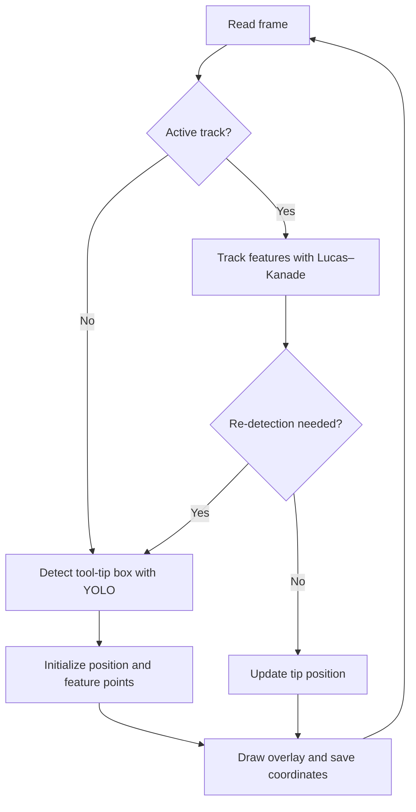

```mermaid
flowchart TD
    A["Read frame"] --> B{"Active track?"}
    B -- No --> C["Detect tool-tip box with YOLO"]
    C --> D["Initialize position and feature points"]
    B -- Yes --> E["Track features with Lucas–Kanade"]
    E --> F{"Re-detection needed?"}
    F -- Yes --> C
    F -- No --> G["Update tip position"]
    D --> H["Draw overlay and save coordinates"]
    G --> H
    H --> A
```
