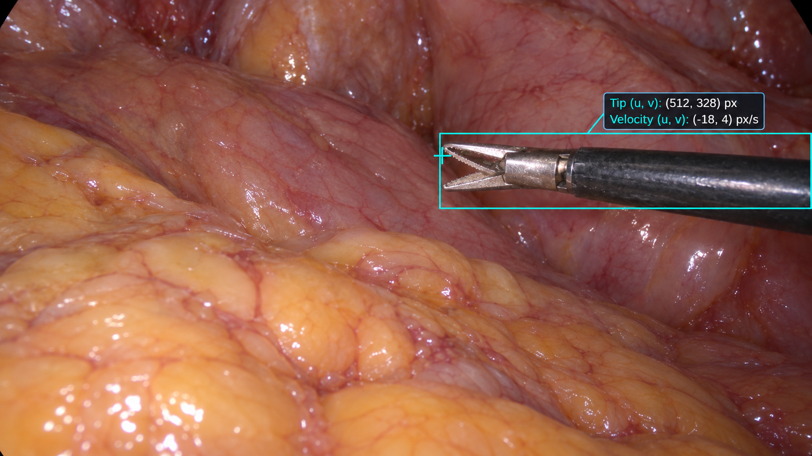
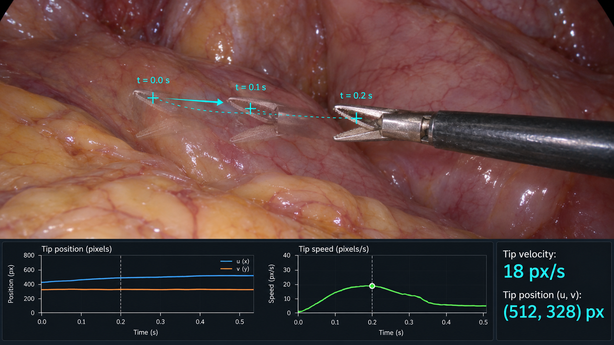

# EN.601.661(02) Computer Vision - Course Project

- click [here](https://whiteboard.cloud.microsoft/me/whiteboards/p/c3BvOmh0dHBzOi8vbGl2ZWpvaG5zaG9wa2lucy1teS5zaGFyZXBvaW50LmNvbS9wZXJzb25hbC9hY2hlcnV2Ml9qaF9lZHU%3d/b!reAG3KHhS0aF67rzwluLoFWuxjk4lm5Gk9qaOkSgffEI5GWe4kiDT5oXWVzVnAmd/01DEIPJTX726LX3CGVOREZ3MOCWX6DKZ3L?fromShare=true) to write board
- click [here](https://jhu.instructure.com/courses/132294) to Canvas
- click [here](https://livejohnshopkins-my.sharepoint.com/:w:/g/personal/acheruv2_jh_edu/IQBN9RqY8ZXrRK03YlWsyuwFAWJvzYI30u94DS1zw56gDf4?e=qS2Mm1) to Pre-proposal (Shared Documents)

## Group members
- Alex Luna-Ow <alunaow1@jh.edu>
- Ahmed Cheruvattam <acheruv2@jh.edu> 
- Vincentz Luo <zluo46@jh.edu>
- Will Luo <yluo87@jh.edu>

## Todo List
1. Implement different method/models (At least one for each member)
   - [Video-Based Surgical Tool-Tip and Keypoint Tracking Using Multi-Frame Context-Driven Deep Learning Models](https://shadowfax11.github.io/mfc_tracking/)
   - [SRT-H: A hierarchical framework for autonomous surgery via language-conditioned imitation learning
](https://www.science.org/doi/full/10.1126/scirobotics.adt5254)
3. Do comparison with a new data set
4. TBD

## Important Deadlines
| Assignment | Due Date | Points |
|---|---|--|
| Project Pre-proposal | October 5 | 5 |
| Homework 1 | October 12 | 100 |
| Project Full Proposal | October 19| 10 |
| Project Paper Review | October 26 | 10 |
| Project Midpoint Check-in | November 13 | 10 |
| Project Final Report | December 7 | 50 |
| Project Presentation (Slide Upload) | Not specified| Not specified |

## Instrument Tracking and Kinematics

### Goal

Identify and track surgical instrument tips across video frames sampled at fixed time intervals. Record each tip’s image coordinates consistently and use its trajectory to estimate velocity and speed in pixels per second.

Figure 1 illustrates the annotation of an instrument in a single frame, including a tip marker, a bounding box, and position and velocity information. Figure 2 illustrates how tracking the tip over time supports trajectory visualization and kinematic analysis.

<table>
  <tr>
    <td width="50%" align="center">
      
       
      <strong>Figure 1. Single-frame instrument annotation.</strong>
      A cyan cross marks the selected tip location, while a bounding box indicates the instrument region. The overlay displays tip coordinates and image-plane velocity components.
    </td>
    <td width="50%" align="center">
      
       
      <strong>Figure 2. Tool-tip tracking and kinematic visualization.</strong>
      Overlaid instrument positions at 0.0, 0.1, and 0.2 seconds illustrate motion over time. The lower panels show example position and speed curves.
    </td>
  </tr>
</table>

These figures illustrate the intended annotation and visualization concepts; the displayed values and curves should not be treated as validated measurements. The image coordinates labelled u and v correspond to x and y, respectively, in the notation below.

### Annotation Consistency

Consistent annotation requires the following:

- Track the same instrument across frames using a persistent instrument ID.
- Apply the same anatomical or geometric definition of the tool tip in every frame, including when the instrument jaws open or close.
- Use the same image coordinate system and image resolution throughout the analysis.
- Mark the tip as occluded or out of frame when its location cannot be reliably identified.

The tip marker in Figure 1 illustrates the point to be recorded. The sequence in Figure 2 illustrates why the same point definition must be maintained across time.

### Position

At sampled time step i, represent the tool-tip position as:

$$
\mathbf p_i=(x_i,y_i)
$$

The coordinates are measured in pixels. The origin is at the image’s upper-left corner, with x increasing to the right and y increasing downward.

As illustrated in Figure 1, tip coordinates can be displayed directly on the video frame. Recording these coordinates over time produces the position curves illustrated in Figure 2.

### Time Interval

For a constant-frame-rate video with frame rate f frames per second, consecutive frames are separated by:

$$
\Delta t=\frac{1}{f}
$$

If every k-th frame is labelled, the interval between labelled frames is:

$$
\Delta t=\frac{k}{f}
$$

The three overlaid positions in Figure 2 illustrate sampling at an interval of 0.1 seconds. For videos with irregular frame timing, use actual frame timestamps.

### Velocity

For equally spaced samples, estimate the velocity at labelled frame i using the central-difference formula:

$$
\mathbf v_i\approx
\frac{\mathbf p_{i+1}-\mathbf p_{i-1}}{2\Delta t}
\qquad \text{pixels/second}
$$

Here, i − 1 and i + 1 refer to the previous and next labelled samples, respectively.

The horizontal and vertical velocity components are:

$$
v_{x,i}\approx\frac{x_{i+1}-x_{i-1}}{2\Delta t},
\qquad
v_{y,i}\approx\frac{y_{i+1}-y_{i-1}}{2\Delta t}
$$

Figure 1 illustrates how these two components can be displayed alongside the instrument. Their signs indicate the direction of motion along each image axis.

This estimate requires valid tip positions at both neighbouring samples. Missing or occluded positions must be handled explicitly before calculating velocity.

### Speed

Speed measures how fast the tip moves, regardless of direction:

$$
s_i=\|\mathbf v_i\|
=\sqrt{v_{x,i}^{2}+v_{y,i}^{2}}
\qquad \text{pixels/second}
$$

The speed curve in Figure 2 illustrates how this quantity can be plotted over time. The scalar readout labelled “Tip velocity” in that figure should be interpreted as “Tip speed”; velocity itself has both horizontal and vertical components.

### Bounding Box

A bounding box may be recorded as an additional annotation to describe the instrument’s extent in the image, as illustrated in Figure 1.

The bounding-box centre is not necessarily the tool tip. Tip coordinates must therefore be labelled separately.

### Interpretation and Limitations

These measurements describe two-dimensional motion in the image plane. Camera movement, zoom, and perspective can affect the observed trajectory and speed.

Converting pixels per second into physical units, such as millimetres per second, requires additional calibration and geometric information. Annotation noise can also affect velocity estimates because they are calculated from differences between positions.
